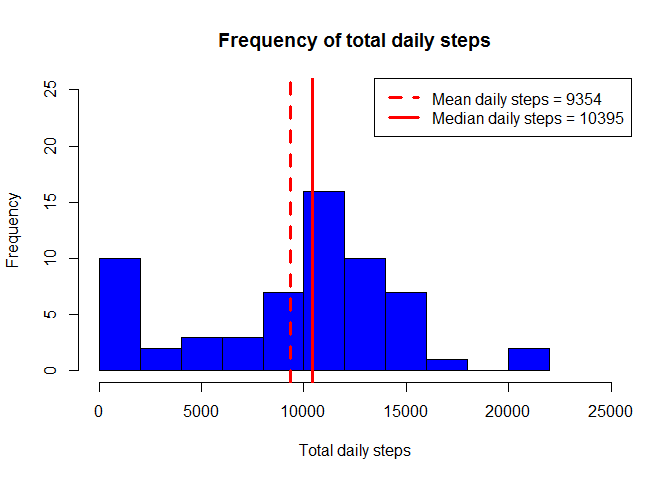
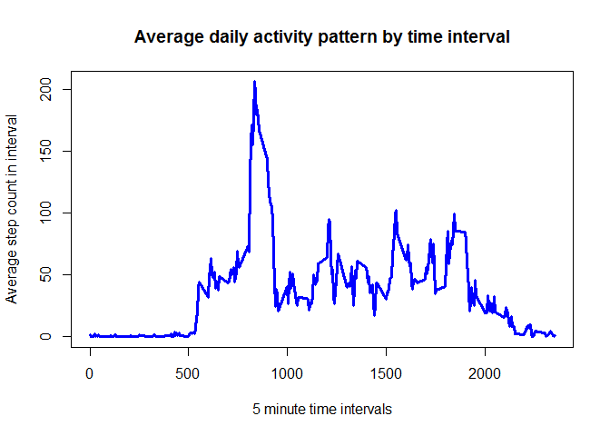
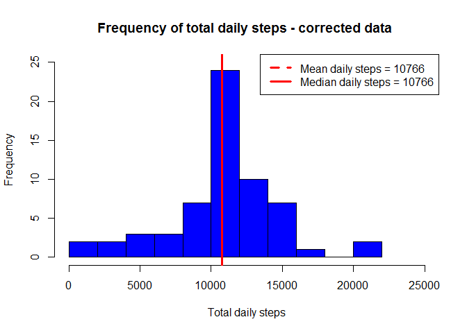
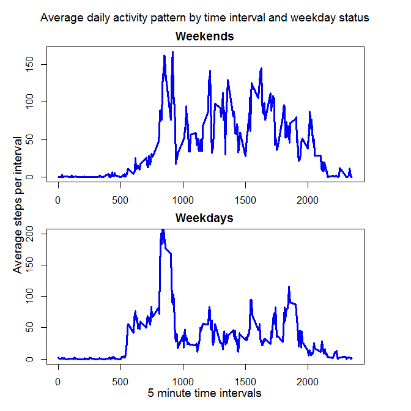

# Reproducible Research - Activity Analysis Assignment
Lynda Young  
24 April 2017  


# Analyis of Activity Data

This assignment makes use of data from a personal activity monitoring device. This device collects data at 5 minute intervals through out the day. The data consists of two months of data from an anonymous individual collected during the months of October and November, 2012 and includes the number of steps taken in 5 minute intervals each day.

The steps/analysis performed are as follows:

1. Obtaining and examining the data
2. A frequency plot of the daily total step count (includes the median and mean values)
3. A time-series plot of the average daily step activity by 5 minute time intervals (includes identification of the interval with the highest average steps)
4. Imputation of missing step values and repeating step 2. on corrected data
5. Comparison of average daily step activity by intervals for weekends vs weekdays


##1: Obtain and pre-process data


```r
library(downloader)

# obtain and read in data
#setwd("C:/Users/Lynda Young/Documents/Coursera/Reproducible Research")
#fileUrl <- "https://d396qusza40orc.cloudfront.net/repdata%2Fdata%2Factivity.zip"
#download.file(fileUrl,destfile = "activity.zip")
#unzip("./activity.zip", exdir = ".")
activity_data <- read.csv("activity.csv")

# investigate   
summary(activity_data)
```

```
##      steps                date          interval     
##  Min.   :  0.00   2012-10-01:  288   Min.   :   0.0  
##  1st Qu.:  0.00   2012-10-02:  288   1st Qu.: 588.8  
##  Median :  0.00   2012-10-03:  288   Median :1177.5  
##  Mean   : 37.38   2012-10-04:  288   Mean   :1177.5  
##  3rd Qu.: 12.00   2012-10-05:  288   3rd Qu.:1766.2  
##  Max.   :806.00   2012-10-06:  288   Max.   :2355.0  
##  NA's   :2304     (Other)   :15840
```

```r
# change date from factor to date format
activity_data$date <- as.Date(activity_data$date, "%Y-%m-%d")
```

##2.  Plot 1 - Histogram of total daily steps 


```r
# calculate total number of steps each day (prior to imputing any missing data) 
# summarise interval information into daily information and include total 
library(dplyr)
```

```
## 
## Attaching package: 'dplyr'
```

```
## The following objects are masked from 'package:stats':
## 
##     filter, lag
```

```
## The following objects are masked from 'package:base':
## 
##     intersect, setdiff, setequal, union
```

```r
daily_data <- activity_data %>%  # new dataset summarising daily totals
     group_by(date) %>%
     summarise(total_steps = sum(steps,na.rm = TRUE))

# calculate mean and median for daily totals
mean_steps <- round(mean(daily_data$total_steps),0)
median_steps <- round(median(daily_data$total_steps),0)

# plot histogram and annotate with mean and median information
hist(daily_data$total_steps, col = "blue", main = "Frequency of total daily steps",
        breaks = 15, xlab = "Total daily steps",xlim = c(0,25000),ylim= c(0,25))
abline(v=mean_steps, col="red", lty=2,lwd=3)
abline(v=median_steps, col="red", lty=1,lwd=3)
legend("topright",legend = c(paste("Mean daily steps = ",mean_steps,sep=""),
        paste("Median daily steps = ",median_steps,sep="")),col=c("red","red"),
        lty = c(2,1), lwd = c(3,3))
```

<!-- -->

##3. Plot 2 - Time series of average daily activity pattern

```r
# summarise daily & interval information by intervals and include average for each interval 
interval_data <- activity_data %>%  # new dataset summarising interval average steps
     group_by(interval) %>%
     summarise(average_steps = mean(steps,na.rm = TRUE))

# plot line chart of the 5 minute intervals and average steps across all days 
with(interval_data, plot(interval,average_steps, col = "blue", type = "l", lwd = 3,
        main = "Average daily activity pattern by time interval",
        pch = 1, ylab = "Average step count in interval",xlab="5 minute time intervals"))
```

<!-- -->

```r
max_average_steps <- max(interval_data$average_steps) # max steps across all intervals
interval_with_max_steps <- interval_data$interval[interval_data$average_steps == max_average_steps] # interval with max steps
```


The 5 minute interval with the maximum number of steps (on average) is 835.

##4. Impute missing steps

There are 2304 rows in the data with missing (NA) step count values.

The missing values will be imputed as the interval average across all days as per the code below.

```r
# create a new data set that has missing values set to the average for each interval with missing values
activity_data_corrected <- merge(activity_data,interval_data) # add in average steps for each interval
activity_data_corrected$steps[is.na(activity_data_corrected$steps)] <- 
        activity_data_corrected$average_steps[is.na(activity_data_corrected$steps)] # set missing values = average
sum(is.na(activity_data_corrected$steps))  # check no missing values left
```

```
## [1] 0
```

```r
# recalculate daily_data
daily_data_corrected <- activity_data_corrected %>%  # new dataset summarising daily totals
     group_by(date) %>%
     summarise(total_steps = sum(steps,na.rm = TRUE))

# re-calculate mean and median for daily totals
mean_steps_corrected <- round(mean(daily_data_corrected$total_steps),0)
median_steps_corrected <- round(median(daily_data_corrected$total_steps),0)

#plot 1 histogram repeated with mising data imputed
hist(daily_data_corrected$total_steps, col = "blue", main = "Frequency of total daily steps - corrected data ",
        breaks = 15, xlab = "Total daily steps",xlim = c(0,25000),ylim=c(0,25))
abline(v=mean_steps_corrected, col="red", lty=2,lwd=3)
abline(v=median_steps_corrected, col="red", lty=1,lwd=3)
legend("topright",legend = c(paste("Mean daily steps = ",mean_steps_corrected,sep=""),
        paste("Median daily steps = ",median_steps_corrected,sep="")),col=c("red","red"),
        lty = c(2,1), lwd = c(3,3))
```

<!-- -->

Imputing the missing steps has impacted on both the mean and median resulting in them now being the same. Imputing has increased the mean number of steps per day to a greater degree than it increased the median. With imputing:

- the mean number of steps increased by 1412 steps to 10766 
- the median number steps increased by 371 steps to `format(r median_steps_corrected,0)`

##5. Activity levels on weekends vs weekdays


```r
# calcluate day of the week variable
activity_data_corrected$day <- NULL
activity_data_corrected$day <- weekdays(activity_data_corrected$date)

# calculate type of day variable  - weekend or weekday
activity_data_corrected$type_of_day <- "weekday"  # initialise all as weekdays
activity_data_corrected$type_of_day[activity_data_corrected$day == "Saturday" | 
        activity_data_corrected$day == "Sunday"] <- "weekend"  # allocate to weekend

# summarise daily & interval information by intervals and type of day and include average for each  
interval_data_corrected <- activity_data_corrected %>%  # new dataset summarising interval average steps
     group_by(interval,type_of_day) %>%
     summarise(average_steps = mean(steps,na.rm = TRUE))

# set up margins etc
par(mfrow=c(2,1), oma = c(2,2,2,2),mar=c(2,2,2,2))


# plot 2 line charts of the 5 minute intervals and average steps separately for weekend and weekdays 

# separate weekend and weekday interval data
weekend_data <- filter(interval_data_corrected,type_of_day == "weekend")
weekday_data <- filter(interval_data_corrected,type_of_day == "weekday")

#make plots
with(weekend_data,plot(interval,average_steps, col = "blue",type = "l", lwd = 3,main = "Weekends",
        pch = 1),ylab="",xlab="",xaxt="n",ylim=c(0,200)) 
with(weekday_data, plot(interval,average_steps, col = "blue",type = "l", lwd = 3,main = "Weekdays",
        pch = 1,ylim=c(0,200) ))

#add overall heading and legends
mtext("Average daily activity pattern by time interval and weekday status", 
        side=3,outer = TRUE, cex = 1.2 )
mtext("Average steps per interval",side=2,outer = TRUE, cex = 1.2 )
mtext("5 minute time intervals",side=1,outer = TRUE, cex = 1.2 )
```

<!-- -->


Not surprisingly, the step counts across the day are generally lower for weekdays between 9am and 5pm than they are on weekends. 

